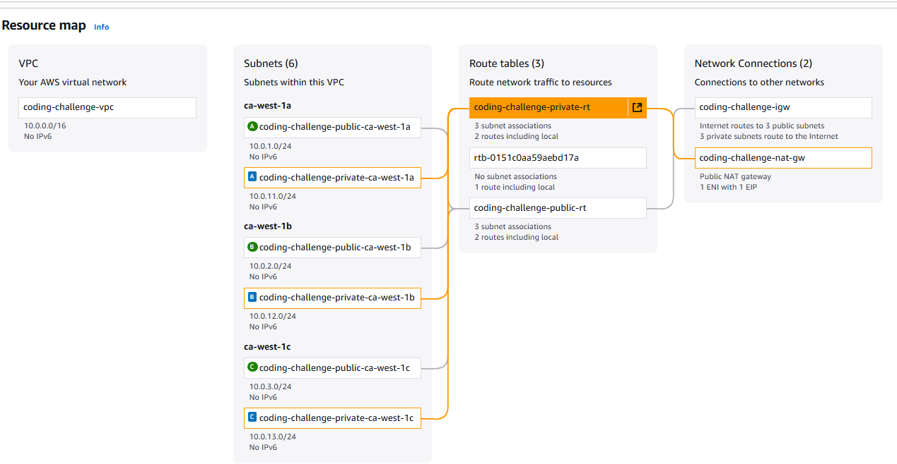

# Terraform AWS Coding Challenge

## Architecture

## Resource map

## Overview

This Terraform project provisions an AWS Virtual Private Cloud (VPC) with public and private subnets distributed across multiple Availability Zones. It deploys an EC2 instance in a public subnet with an Nginx web server installed and running, accessible over HTTP (port 80).

---

## Features

- Creates a VPC with CIDR block `10.0.0.0/16`
- Developed a reusable VPC module to clearly separate infrastructure components
- Creates three public and three private subnets, each in different Availability Zones
- Public subnets have internet access via an Internet Gateway
- Private subnets do NOT have direct internet connectivity, routed through a NAT Gateway
- Only allowed port 80 as per given instructions, I didn't even allow SSH(port 22) Access
- Deploys an EC2 instance in a public subnet with:
  - Nginx web server running and reachable via HTTP (port 80)
  - Security Group allowing inbound HTTP access from anywhere (`0.0.0.0/0`)
- Parameterized Terraform code for reusability and flexibility
- Outputs the public IP address to access the Nginx web page

---

## Prerequisites

- AWS account with appropriate permissions
- AWS CLI configured with credentials
- Terraform >= 1.5.0 installed

---

## Usage

- Use `terraform.tfvars` to override default variables.
- Run `terraform init`, `terraform plan`, and `terraform apply`.
- Wait a couple of minutes to update and install nginx web server.
- Take the public ip from output and hit with your browser and you will see nginx web page.

---